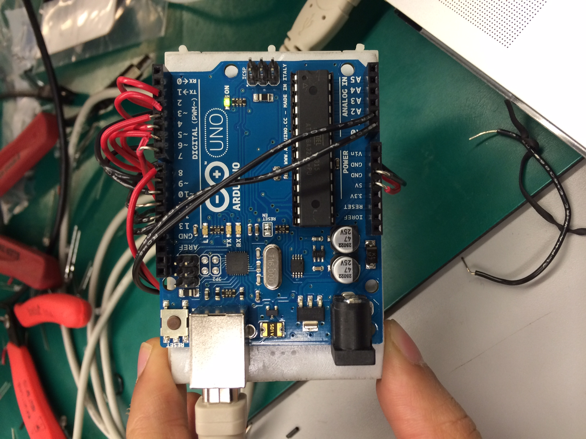
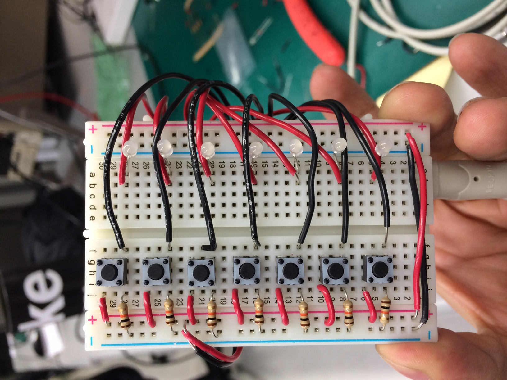

## Binary Arduino Game

Type in the binary representation of the base 10 as fast as you can!

### Run.

Install this on a Arduino Uno then run `python serial_read.py` for a fun game.

### Pics.

### License.

MIT.
